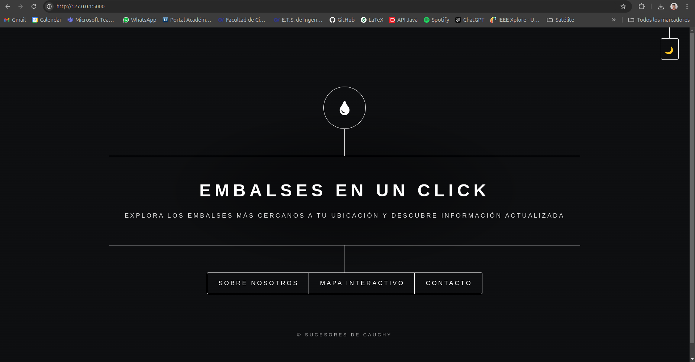
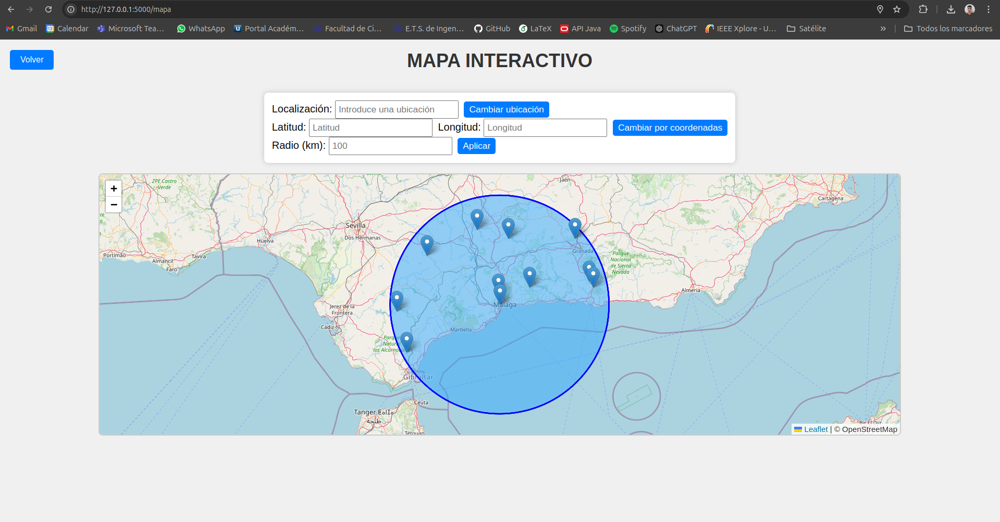
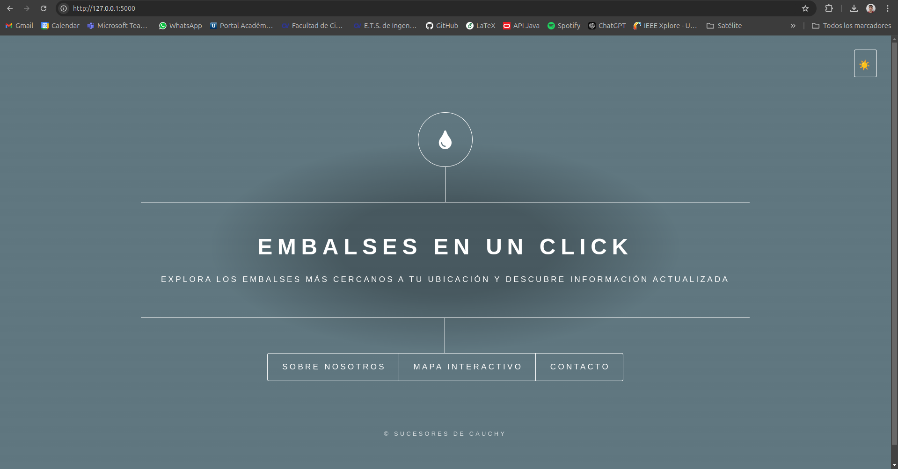

# malackaton_final
# Proyecto de Gestión de Embalses en Oracle Cloud

## Introducción

Como equipo participante en este proyecto, hemos tenido la oportunidad de trabajar con datos sobre embalses españoles utilizando la infraestructura de Oracle Cloud (OCI). A lo largo de esta experiencia, hemos desarrollado una aplicación que gestiona y analiza información de embalses, permitiendo el acceso a datos relevantes de manera segura y eficiente. Este proceso nos ha permitido aprender sobre la integración de bases de datos, la creación de aplicaciones web y la implementación de medidas de seguridad para proteger los datos y la aplicación.



## Estructura de Datos

Para comenzar, nos hemos familiarizado con las tablas de datos que utilizamos en el proyecto. Hay tres tablas principales que contienen información sobre los embalses:

### Tabla: EMBALSES

Esta tabla incluye los siguientes campos:

- **ID**: Identificador único del embalse.
- **AMBITO_NOMBRE**: Nombre del ámbito del embalse.
- **EMBALSE_NOMBRE**: Nombre específico del embalse.
- **AGUA_TOTAL**: Cantidad total de agua que puede almacenar el embalse.
- **ELECTRICO_FLAG**: Un indicador que señala si el embalse se utiliza para generar electricidad.

### Tabla: AGUA_ALMACENADA

Esta tabla proporciona datos sobre la cantidad de agua almacenada:

- **FECHA**: Fecha de registro de la información.
- **AGUA_ACTUAL**: Cantidad actual de agua en el embalse en esa fecha.
- **ID**: Identificador del embalse, que relaciona esta tabla con la tabla EMBALSES.

### Tabla Complementaria: LISTADO_EMBALSES

Esta tabla contiene información adicional sobre los embalses y sus características:

- **CODIGO**: Código del embalse.
- **NOMBRE**: Nombre del embalse.
- **EMBALSE**: Información adicional sobre el embalse.
- **X/Y**: Coordenadas geográficas.
- **DEMARC**: Demarcación hidrográfica.
- **CAUCE**: Cauce del embalse.
- **GOOGLE, OPENSTREETMAP, WIKIDATA**: Enlaces a recursos externos.

## Sobre Nosotros

Somos un equipo apasionado por la tecnología, la naturaleza y el acceso a la información de manera sencilla y eficiente. Nuestra misión es acercar los embalses de España a todos, ya sea para planificar una escapada al aire libre, investigar la disponibilidad de agua en ciertas áreas o simplemente disfrutar de los recursos naturales de nuestro país.

Sabemos lo importante que es proporcionar datos precisos y actualizados, por eso hemos creado una aplicación web que permite visualizar los embalses más cercanos a tu ubicación, todo desde la comodidad de Internet. Además, queremos que la información sea accesible para todos, por lo que nos hemos comprometido a desarrollar una web inclusiva, intuitiva y fácil de usar.

Nuestro equipo está compuesto por estudiantes de tercer curso del Doble Grado de Matemáticas e Ingeniería Informática de la Universidad de Málaga, todos unidos por un objetivo común: hacer que los datos hídricos de España sean accesibles, comprensibles y útiles para todos.

¡Explora nuestra web, conoce más sobre los embalses de tu zona y no dudes en contactarnos para cualquier pregunta o sugerencia! Nos encanta aprender de nuestros usuarios y mejorar cada día.
CAA**: Localización del embalse.
- **TIPO, TITULAR, USO**: Información sobre el tipo de embalse, su titularidad y uso.
- **COTA_CORON, ALT_CIMIEN**: Datos sobre la altura y características estructurales.
- **INFORME**: Información adicional sobre el embalse.

### Fusión de Tablas

Dado que no existe una correspondencia perfecta entre los datos de las tablas `EMBALSES` y `LISTADO_EMBALSES`, hemos decidido fusionar estas tablas basándonos en la similitud en el nombre de los embalses. Esta fusión nos permite establecer relaciones más claras entre los datos y obtener un conjunto de datos más completo y coherente.

Al combinar los registros de ambas tablas, hemos podido enriquecer la información sobre los embalses, permitiendo una mejor consulta y análisis de los datos, además de facilitar el desarrollo de la aplicación. Este proceso ha sido clave para abordar los desafíos que presenta la falta de coincidencia entre las fuentes de datos.

## Desarrollo de la Aplicación Web

Para nuestra aplicación web, hemos desarrollado un servidor Flask que actúa como backend. Este backend está diseñado para comunicarse de manera eficiente con la base de datos utilizando una arquitectura de API REST. A continuación, describimos cómo funciona este sistema:

1. **Comunicación entre Backend y Base de Datos**: El backend realiza solicitudes a la base de datos para obtener los datos necesarios sobre los embalses. Estas solicitudes se envían utilizando una API REST, lo que nos permite acceder a la información de manera estructurada y eficiente.

2. **Interacción entre Frontend y Backend**: Por su parte, el frontend de la aplicación también se comunica con el backend a través de una API. Cuando el usuario solicita información, el frontend envía una petición al backend, que procesa la solicitud y devuelve los datos correspondientes.

3. **Eficiencia en el Procesamiento**: Esta arquitectura de API permite que tanto el backend como el frontend se comuniquen de manera independiente y eficiente. Al utilizar un servidor Flask como intermediario, optimizamos el flujo de datos, lo que mejora la velocidad de respuesta de la aplicación y reduce la carga directa sobre la base de datos.

Esta estructura no solo facilita el desarrollo y mantenimiento de la aplicación, sino que también mejora la experiencia del usuario al ofrecer tiempos de carga más rápidos y un acceso más ágil a la información sobre los embalses.

## Sobre Nosotros

Somos un equipo apasionado por la tecnología, la naturaleza y el acceso a la información de manera sencilla y eficiente. Nuestra misión es acercar los embalses de España a todos, ya sea para planificar una escapada al aire libre, investigar la disponibilidad de agua en ciertas áreas o simplemente disfrutar de los recursos naturales de nuestro país.

Sabemos lo importante que es proporcionar datos precisos y actualizados, por eso hemos creado una aplicación web que permite visualizar los embalses más cercanos a tu ubicación, todo desde la comodidad de Internet. Además, queremos que la información sea accesible para todos, por lo que nos hemos comprometido a desarrollar una web inclusiva, intuitiva y fácil de usar.

Nuestro equipo está compuesto por estudiantes de tercer curso del Doble Grado de Matemáticas e Ingeniería Informática de la Universidad de Málaga, todos unidos por un objetivo común: hacer que los datos hídricos de España sean accesibles, comprensibles y útiles para todos.

¡Explora nuestra web, conoce más sobre los embalses de tu zona y no dudes en contactarnos para cualquier pregunta o sugerencia! Nos encanta aprender de nuestros usuarios y mejorar cada día.


### Escalabilidad del Proyecto

Nuestro proyecto está diseñado para ser escalable, ya que al poseer un backend en Python, se abre la puerta a futuras modificaciones y mejoras. Esto incluye la posibilidad de implementar modelos de machine learning para analizar y predecir datos relacionados con los embalses. Esta flexibilidad nos permitirá adaptar la aplicación a nuevas necesidades y aprovechar técnicas avanzadas de análisis de datos en el futuro.

## Accesibilidad e Inclusividad



En nuestro proyecto, hemos priorizado la accesibilidad e inclusividad para asegurar que la aplicación sea fácil de usar para todos. Las características clave incluyen:

### Modo Blanco y Negro

- **Modo Blanco y Negro**: Para facilitar la visualización, hemos implementado un modo de alto contraste que permite a los usuarios alternar entre el modo estándar y el modo blanco y negro. Esta opción es especialmente útil para personas con discapacidades visuales o sensibilidad a los colores.



### Lectura de Información

- **Lectura de Información en Pantalla**: La aplicación incluye una funcionalidad que permite que la información se lea en voz alta. Esta característica está diseñada para ayudar a aquellos que tienen dificultades para leer en pantalla, asegurando que todos los usuarios puedan acceder a los datos de los embalses de manera efectiva.

Con estas características, buscamos crear una aplicación que no solo sea funcional, sino también accesible para todos los usuarios, independientemente de sus necesidades específicas.

## Requisitos del Proyecto

Para llevar a cabo el desarrollo de nuestra aplicación web, hemos utilizado varias bibliotecas y herramientas esenciales. A continuación, se detallan los requisitos del proyecto:

### Bibliotecas y Herramientas Utilizadas

1. **Flask**: Este es el marco de trabajo utilizado para desarrollar el backend de nuestra aplicación web. Nos permite crear aplicaciones web de manera rápida y eficiente.

2. **Requests**: Utilizamos esta biblioteca para realizar solicitudes HTTP, lo que facilita la comunicación entre nuestro backend y la base de datos a través de la API REST.

3. **NumPy**: Esta biblioteca es esencial para realizar operaciones numéricas y manipulaciones de matrices. Nos ayuda a manejar y procesar datos numéricos de manera efectiva.

4. **Pandas**: Utilizamos Pandas para el análisis y manipulación de datos. Esta biblioteca nos permite cargar, transformar y analizar los datos de los embalses de forma sencilla y eficiente.

### Instalación de Dependencias

Para instalar todas las bibliotecas necesarias, puedes utilizar `pip`. Ejecuta el siguiente comando en tu terminal:

```bash
pip install flask requests numpy pandas

```

### Lanzamiento del Servidor

Para iniciar el servidor Flask y poner en marcha nuestra aplicación, es necesario seguir estos pasos:

1. **Ubicación del Archivo**: Asegúrate de que el archivo `app.py` se encuentre en la carpeta `app` de tu proyecto.

2. **Ejecutar el Servidor**: Desde la terminal, navega hasta el directorio donde se encuentra la carpeta `app` y ejecuta el siguiente comando:

   ```bash
   python app/app.py


